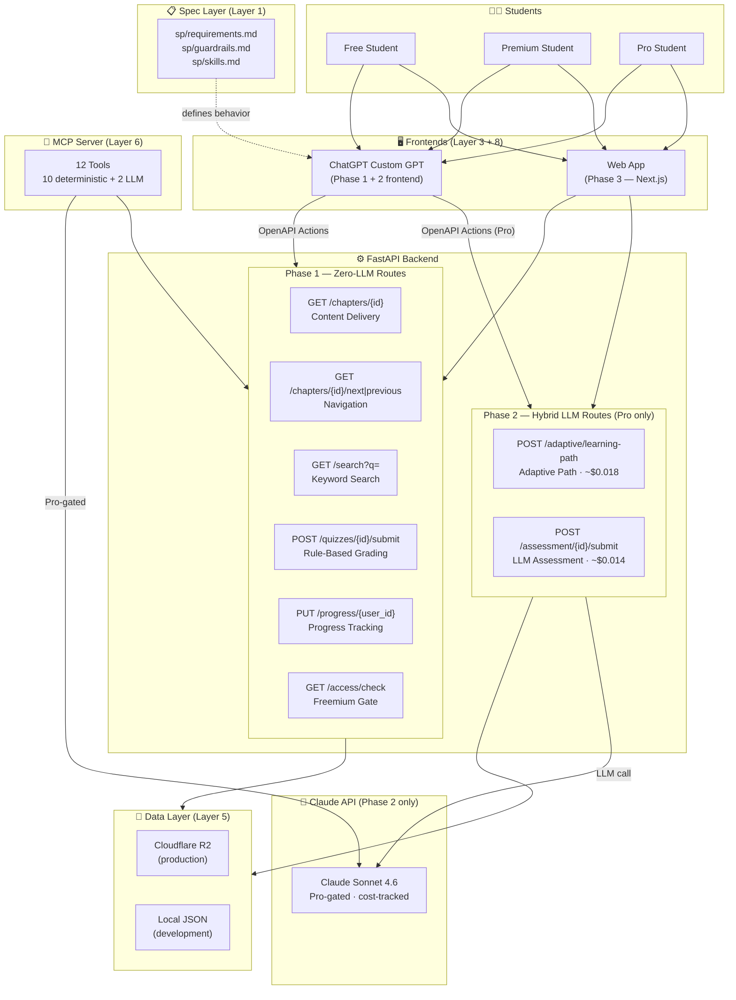
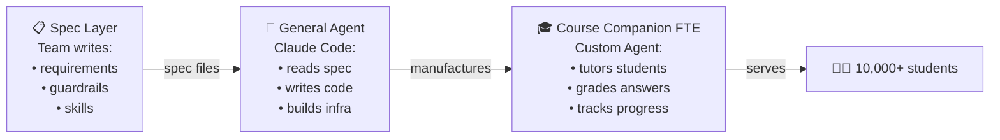
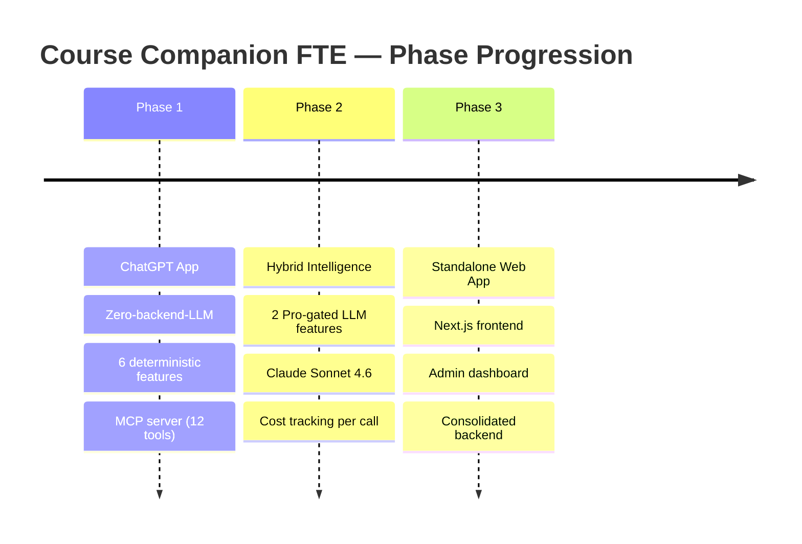
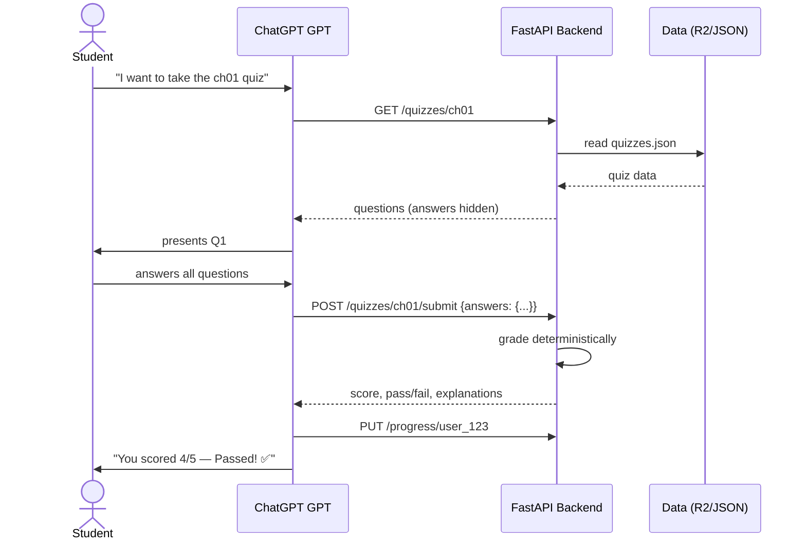
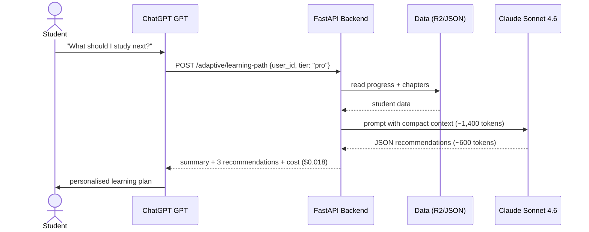

# Architecture Diagram — Course Companion FTE

> Render this file with any Mermaid-compatible viewer (GitHub, Mermaid Live Editor,
> VS Code with Mermaid extension) to generate a PNG/PDF for submission.

## System Architecture

## Agent Factory Pattern

## Phase Progression

## Data Flow — Quiz (Phase 1, Zero-LLM)

## Data Flow — Adaptive Path (Phase 2, LLM)

